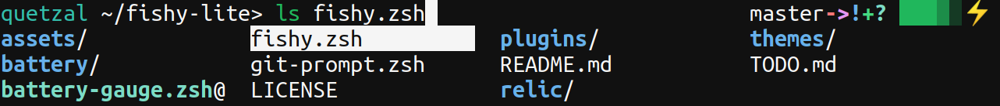

# fishy-lite

Fork of the fishy theme found in oh-my-zsh, with much of the extraneous stuff
cut out. Loads much faster.

Also includes a battery gauge and git display that can be enabled on the
right-hand side of the prompt.

What's removed from oh-my-zsh:

1. Bazaar integration
2. Non-git prompts (RVM, NVM, Mercurial, etc.)

The theme also combines all the relevant oh-my-zsh lib/ files into a single
one. That, along with the excluses, speed up zsh load times from unbearable
(default oh-my-zsh) to tolerable on underpowered hardware, such as SoC devices,
very old computers, etc.




## Installation 

### Manual

Clone this repo and source fishy.zsh in your zshrc, e.g.:
```
source /path/to/fishy-lite/fishy.zsh
```

To enable the battery gauge or git prompt, source the battery-gauge.zsh and
git-prompt.zsh files, respectively.
```
source /path/to/fishy-lite/battery-gauge.zsh
source /path/to/fishy-lite/git-prompt.zsh
```


### Antigen

Antigen compatibility is provided by the symlinks in the plugins/ and themes/
directories. Add the following to your zshrc to enable the custom fishy theme:
```
antigen theme sudorook/fishy-lite themes/fishy
```

To add the battery gauge and git prompt:
```
antigen bundle sudorook/fishy-lite plugins/git
antigen bundle sudorook/fishy-lite plugins/battery
```
