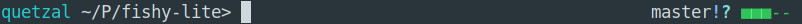
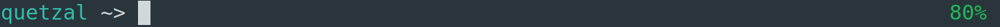

# fishy-lite

Fork of the fishy theme found in oh-my-zsh, with much of the extraneous stuff
cut out. Loads much faster.

Also includes battery gauges and git display that can be enabled on the
right-hand side of the prompt.

What's removed from oh-my-zsh:

1. Bazaar integration
2. Non-git prompts (RVM, NVM, Mercurial, etc.)

The theme also combines all the relevant oh-my-zsh lib/ files into a single
one. That, along with the exclusions, speeds up zsh load times from unbearable
(default oh-my-zsh) to tolerable on underpowered hardware, such as SoC devices,
very old computers, etc.


**Note:** Screenshots are of GNOME terminal with Ubuntu Mono Regular, 14pt.


## Installation 

### Manual

Clone this repo and source fishy.zsh in your zshrc, e.g.:
```
source /path/to/fishy-lite/fishy.zsh
```

To enable the battery gauge or git prompt, source the battery-gauge.zsh and
git-prompt.zsh files, respectively.
```
source /path/to/fishy-lite/battery-gauge.zsh
source /path/to/fishy-lite/git-prompt.zsh
```

### Antigen

Antigen compatibility is provided by the symlinks in the plugins/ and themes/
directories. Add the following to your zshrc to enable the custom fishy theme:
```
antigen theme sudorook/fishy-lite themes/fishy
```

To add the battery gauge and git prompt:
```
antigen bundle sudorook/fishy-lite plugins/git
antigen bundle sudorook/fishy-lite plugins/battery
```


## Extras

The theme comes with the option of three different battery prompts. All three
can be enabled simultaneously, and to enable one, edit your zshrc as follows:

### Bar gauge (default)



Works on command line TTYs (i.e. no display server).

#### Manual
```
source /path/to/fishy-lite/battery/bar.zsh
```

#### Antigen
```
antigen bundle sudorook/fishy-lite plugins/battery-bar
```

### Block gauge


Works on command line TTYs (i.e. no display server).

#### Manual
```
source /path/to/fishy-lite/battery/block.zsh
```

#### Antigen
```
antigen bundle sudorook/fishy-lite plugins/battery-block
```

### Circle gauge


#### Manual
```
source /path/to/fishy-lite/battery/circle.zsh
```

#### Antigen
```
antigen bundle sudorook/fishy-lite plugins/battery-circle
```

### Icon gauge


#### Manual
```
source /path/to/fishy-lite/battery/icon.zsh
```

#### Antigen
```
antigen bundle sudorook/fishy-lite plugins/battery-icon
```

### Percentage gauge



Works on command line TTYs (i.e. no display server).

#### Manual
```
source /path/to/fishy-lite/battery/percent.zsh
```

#### Antigen
```
antigen bundle sudorook/fishy-lite plugins/battery-percent
```

**NOTE:** For the battery gauges to work, you'll need to have acpi installed
and be using a terminal that supports UTF-8 characters.
